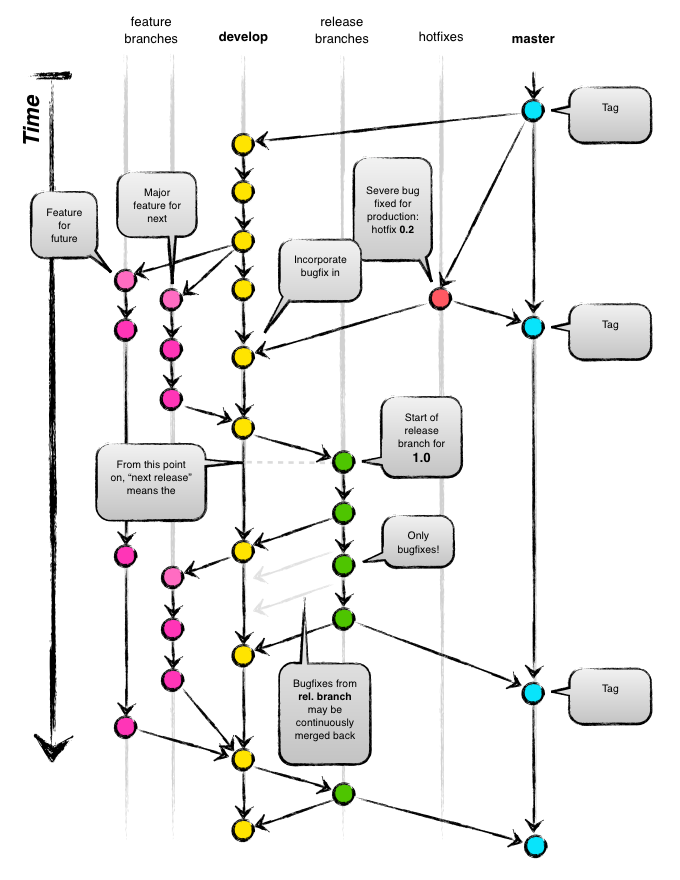

#Git structure
This is a guide for using a particular git branching model when working on a
bigger development project where more developers are involved. This model was
introduced by *Vincent Driessen* in his 
[article](http://nvie.com/posts/a-successful-git-branching-model/)
where you can read about it more indepth with all the explanations and whatnots.

##Overview
The following picture illustartes the big picture of the whole branching model
used for big development projects. You can see different branches living side by
side more or less over the lifetime of the whole project.



Let's dive into the description of all the different branches so we will know
what they are used for.

##Main branches

###master
This is the main and default branch created by GIT itself when initializing any
GIT based repository. In this model however, the `master` branch is a production
ready code which has to be stable and ready for deployment at any given time.
Basically it is the same exact code which is used on production server and on
which the application is running for the whole public.

###develop
This branch is considered as the main development branch, which represents the
latest delivered changes for the release. When the development changes reaches
a stable point, this branch is ready to be marged back into `master` branch.
There are several ways how to merge it though, so stay tuned.

##Supporting branches

###feature
This branch is used for more convinient parallel development of changes within
a larger group of developers. Every developer can work on his particular part
of the code and once the feature is ready, it can be merged back into the 
'develop' branch. The 'feature' branches usually exists on developer local
repositories and not on the central (origin) repository. There may be some
exception to this rule, if more than one developer is working on some particular
feature or if the feature is really complex.

The `feature` branch is always branched of the `develop` branch and must be
always merged back to `develop` branch after the feature is developed.

To create new `feature` branch
```
$ git checkout -b feature-name develop
```

To merge back to `develop` branch once the feature development is complete:
```
$ git checkout develop
$ git pull
$ git merge --no-ff feature-name
$ git branch -d feature-name
$ git push origin develop
```

###release
We have already spoken about one way of merging `develop` into `master` branch
which may be the case of some middle sized project, but in bigger projects we
usually use the supporting `release` branch. The benefit of such branch is that
it allows for preparation of production realease like last-minute bugfixing,
metadata preparation while the `develop` branch is ready to receive new 
modifications for the next upcoming realease.

The `release` branch must be branched of `develop` branch at a time, when all
the features targeted for next release are developed and merged into `develop`
branch. The `release` branch must merge back to `master` and `develop` branches.
(The additional merge back to `develop` is due to the possible cahnges,
bugfixes, metadata in `release` branch). It is also considered best-practice to
create new tag on `master` branch once the `release` branch is merged into it.

To create new `release` branch:
```
$ git checkout -b release-1.1 develop
# modify metadata for versioning
$ git commit -m "Bumped versioning to 1.1"
# possible further bugfixes
```

To merge back to `master` and `develop` branches and create a new tag:
```
$ git checkout master
$ git pull
$ git merge --no-ff release-1.1
$ git tag -a 1.1
$ git push origin master
$ git chcekout develop
$ git pull
$ git merge --no-ff release-1.1
$ git push origin develop
$ git branch -d release-1.1
```

###hotfix
This branch is used for hotfixes that needs to be done on production
immediately. The benefit of creating `hotfix` branch is that the developemnt of
new features on `develop` branch can continue in parallel.

The `hotfix` branch must branch of the `master` branch and once the bugs are
fixed, it must be merged back to `master` and `develop` branch to reflect the
fixes on both the production and development. It is also considered
best-practice to create tag on master to mention the hotfix branch.

To create new `hotfix` branch:
```
$ git checkout -b hotfix-1.1.1 master
# modify metadata for versioning
$ git commit -m "Bumped versioning to 1.1.1"
# possible further bugfixes
$ git commit -m "Fixed problem on production"
```

To merge back to `master` and `develop` branches and create a new tag:
```
$ git checkout master
$ git pull
$ git merge --no-ff hotfix-1.1.1
$ git tag -a 1.1.1
$ git push origin master
$ git checkout develop
$ git pull
$ git merge --no-ff hotfix-1.1.1
$ git push origin develop
$ git branch -d hotfix-1.1.1
```

###staging
Additional to the article mentioned in the begining, we have come across some
situations where we needed to stage our work for preview for the client. For
such purposes you can use additional `staging` branch, where you can modify the
metadata and configuration for staging/preview server. The difference between
`staging` branch and all the other branches is that it should only be branched
and never merged back into any of the above mentioned branches. It sole purpose
is just preview. The `staging` branch may be branched of `develop`, `release` or
even `feature` branches. (It depends on how you agreed with your client
- if he wants to preview only the release cycle features, stable features or
even the work in progress features.)
